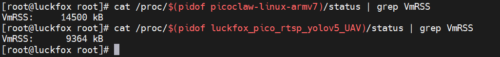

# Luckfox Pico UAV Detection System


Real-time UAV (drone) detection system running on Luckfox Pico embedded board using YOLOv5 and RTSP streaming, with an embedded AI assistant powered by [PicoClaw](https://github.com/sipeed/picoclaw).

## ⚠️ Legal Notice

This project is intended for **educational and research purposes only**. Users are responsible for ensuring compliance with all applicable local, state, and federal laws regarding surveillance, privacy, and airspace monitoring. The authors and contributors assume no liability for misuse of this software.

## 🛡️ Project Origin & IP Disclaimer

**This project is a strictly personal, open-source endeavor.**

*   **Hardware:** Developed exclusively on the **Luckfox Pico (Rockchip RV1106)**, a $25 hobbyist embedded Linux board.
*   **Software:** Relies entirely on the open-source **Rockchip RKNN SDK** and **YOLOv5n**.
*   **Separation:** No proprietary algorithms, code, hardware, or intellectual property from my professional work (Defense/Aerospace) were used. The techniques used here (NPU/RGA on Rockchip) are architecturally distinct from FPGA-based RTL designs.

## Overview

This system achieves **blazing fast 20 FPS** real-time UAV detection on the Luckfox Pico Pro/Max boards (RV1106G2/3) using hardware-accelerated RGA (Raster Graphic Acceleration) operations, demonstrating highly efficient edge AI deployment for aerial object detection.

### Performance Breakthrough

**19x Speedup** achieved over the official Luckfox GitHub examples through complete elimination of OpenCV dependencies and exclusive use of hardware-accelerated RGA functions for all image preprocessing operations:

- **NV12 to RGB888 conversion** - Hardware accelerated
- **Image scaling** - Hardware accelerated  
- **Letterboxing** - Hardware accelerated
- **DMA buffer operations** - Zero-copy direct to RKNN inference

This optimization provides a **19x performance improvement** for raster operations (scaling, letterboxing, format conversion) compared to CPU-based OpenCV implementations: 38ms vs merely 2ms.

### Features

- **20 FPS** real-time RTSP video streaming with UAV detection
- YOLOv5-based detection using RKNN neural network acceleration
- Ultra-low latency video processing (~40ms)
- **Zero OpenCV dependencies** - pure RGA hardware acceleration
- **MAVLink telemetry streaming** - detection data streamed via UART using MAVLink protocol for integration with autopilots and ground control stations
- Runs entirely on embedded hardware
- 720x480 @ 30fps video capture with real-time inference
- Direct DMA buffer operations for maximum efficiency

## 🦐 Embedded AI Assistant (PicoClaw)

The system integrates [PicoClaw](https://github.com/sipeed/picoclaw) — an ultra-lightweight AI assistant (<10 MB RAM, <1s boot) — running directly on the LuckFox Pico. It connects to your Telegram and lets you query UAV movement analysis in natural language without leaving your phone.

### What it does

- Reads binary detection logs produced by `read_detections`
- Computes UAV trajectory, approach vector, speed, and movement pattern
- Responds via Telegram

### Internet Access via SSH Reverse Tunnel

The LuckFox has no direct internet access. You must forward your host machine's internet connection to the device over SSH. **Run this from a Windows CMD / PowerShell or Linux terminal on your host before starting picoclaw:**

```cmd
ssh -R 1080 root@172.32.0.93 -N
```

This opens a SOCKS5 proxy on `127.0.0.1:1080` on the device. The `build_and_load.sh` script automatically writes `ALL_PROXY` and `HTTPS_PROXY` pointing to it into `/etc/profile.d/picoclaw.sh`, so picoclaw picks them up on every login.

### Setup

All picoclaw setup (binary upload, CA certificate, config, workspace files) is automated inside `build_and_load.sh`. Before the first flash, fill in your credentials:

```bash
# Copy the template and fill in your real keys
cp utility_cmds/credentials/credentials.sh utility_cmds/credentials/credentials.secret.sh
# Edit credentials.secret.sh with your DeepSeek API key and Telegram bot token
```

Then run the normal build-and-load script — picoclaw and all its config are deployed automatically on first run, skipped on subsequent runs.

### Starting picoclaw on the device

```bash
# On your host — forward internet access first:
ssh -R 1080 root@172.32.0.93 -N &

# Then SSH into the device and start picoclaw:
ssh root@172.32.0.93
source /etc/profile.d/picoclaw.sh
/root/picoclaw agent
```

## Hardware Requirements

- **Luckfox Pico Pro or Max** development board (RV1106G2/3)
- Compatible camera module (SC3336)
- USB Cable
- (Opt.) UART-TTL USB adapter

## Software Dependencies

- Make sure to have the cross compiler folders and exportedin PATH. Simply follow this:
https://wiki.luckfox.com/Luckfox-Pico-Pro-Max/Cross-Compile

## Installation

### 1. Clone Repository

```bash
git clone https://github.com/alebal123bal/luckfox_UAV_detection.git
cd luckfox_UAV_detection
```

### 2. Build

```bash
chmod +x build.sh
./build.sh
```

### 3. Deploy to Board

```bash
cd install/uclibc/luckfox_pico_rtsp_yolov5_UAV_demo/
# Copy files to your Luckfox Pico board
scp -r * root@<board-ip>:/path/on/board/
```

### 4. Run on Board

```bash
ssh root@<board-ip>
cd /path/on/board/
chmod a+x luckfox_pico_rtsp_yolov5_UAV
./luckfox_pico_rtsp_yolov5_UAV
```

## Usage

### Viewing the Stream

Use the provided utility script to view the RTSP stream:

```bash
bash utility_cmds/smooth_stream.sh
```

Or directly with FFplay:

```bash
ffplay -fflags nobuffer+fastseek -flags low_delay -framedrop -sync ext \
       -probesize 32 -analyzeduration 0 -rtsp_transport udp \
       -max_delay 0 -reorder_queue_size 0 rtsp://172.32.0.93/live/0
```

### Configuration

- **RTSP URL**: Default `rtsp://172.32.0.93/live/0` (update in scripts as needed)
- **Model**: YOLOv5 model located in `luckfox_pico_rtsp_yolov5_UAV/model/`
- **Input Resolution**: 720x480
- **Inference Resolution**: 640x640

## Model Training

Make sure to train using RKNN-compatible Neural Network Layers (typical example: SiLU replaced by ReLU).

My advice is to use the **already modded YOLOv5n implementation by RockChip**:
https://github.com/airockchip/yolov5.git

and train from there.

### Model Conversion

The already converted RKNN model is provided.

If you have trouble converting the model from .pt to .onnx and then to .rknn, refer
to the excellent LuckFox guide:
https://wiki.luckfox.com/Luckfox-Pico-Pro-Max/RKNN

or contact me directly:
balzanalessandro2001@gmail.com

https://www.linkedin.com/in/alessandro-balzan-b024a9250/

## Project Structure

```
luckfox_UAV_detection/
├── build.sh                    # Build script
├── CMakeLists.txt             # CMake configuration
├── include/                   # Header files (RK SDK, RKNN, etc.)
├── lib/                       # Compiled libraries
├── luckfox_pico_rtsp_yolov5_UAV/
│   ├── src/                   # Source code
│   ├── model/                 # YOLOv5 RKNN model
│   └── include/               # Project headers
├── tools/                     # Host-side toolchain binaries
│   ├── picoclaw-linux-armv7   # PicoClaw ARM binary
│   └── picoclaw/              # PicoClaw AI assistant config
│       ├── credentials.sh     # Credential template (committed)
│       ├── credentials.secret.sh  # Real keys (gitignored)
│       └── workspace/         # Agent markdown files
│           ├── AGENT.md
│           ├── IDENTITY.md
│           ├── SOUL.md
│           └── USER.md
├── utility_cmds/              # Helper scripts
│   ├── fast_stream.sh         # Low-latency stream viewer
│   ├── build_and_load.sh      # Build + deploy everything
│   ├── credentials/           # Picoclaw API keys
│   │   ├── credentials.sh     # Credential template (committed)
│   │   └── credentials.secret.sh  # Real keys (gitignored)
│   └── steps/                 # Individual deployment steps
└── install/                   # Build output
```

## Performance

- **FPS**: 20 FPS (inference + streaming)
- **Latency**: ~40ms end-to-end
- **Platform**: Luckfox Pico Pro/Max (RV1106G2/3)
- **Speedup**: 19x faster image preprocessing vs OpenCV CPU-based operations; this means 20FPS versus 7FPS
- **Optimization**: Pure RGA hardware acceleration, zero OpenCV dependencies

### RAM Usage



The entire system is remarkably lean. Running both the YOLOv5 detection pipeline and the PicoClaw AI assistant simultaneously leaves the board's memory almost completely free:

| Process | RAM |
|---|---|
| YOLOv5 detection pipeline | ~9,300 kB |
| PicoClaw AI assistant | ~14,500 kB |
| **Total** | **~23,800 kB** |

Out of 128 MB (RV1106G2) or 256 MB (RV1106G3) total — that's less than 20% used on the smaller variant, and under 10% on the larger one.

## Technical Implementation

### Hardware-Accelerated Image Preprocessing

All image preprocessing operations leverage the RV1106's hardware RGA (Raster Graphic Acceleration) unit:

```cpp
// Hardware-accelerated letterbox pipeline
rga_letterbox_nv12_to_rknn(
    src_fd, src_w, src_h,           // NV12 input from camera
    rknn_input_attr.type,           // Direct DMA to RKNN
    model_width, model_height,       // Target inference size
    &scale, &leftPadding, &topPadding
);
```

This single hardware-accelerated function replaces multiple CPU-intensive OpenCV operations:
- Color space conversion (NV12 → RGB888)
- Image resizing with aspect ratio preservation
- Letterbox padding for YOLO input
- Memory copying to inference buffer

**Result**: 19x performance improvement over CPU-based preprocessing

### MAVLink Telemetry Integration

Detection results are streamed in real-time via UART using the MAVLink protocol for seamless integration with autopilots and ground control stations:

```cpp
// Send detection via MAVLink
mavlink_send_detection(
    uart_fd,
    x, y, width, height,           // Bounding box coordinates
    confidence, class_id,           // Detection confidence & class
    target_num,                     // Target identifier
    frame_width, frame_height       // Frame dimensions
);
```

**MAVLink features:**
- Custom message ID (9000) for UAV detection data
- Normalized coordinates (-1 to 1) for platform-independent positioning
- Timestamp synchronization for multi-sensor fusion
- CRC-16 checksum for data integrity
- Compatible with Mission Planner, QGroundControl, and custom GCS applications

This enables:
- Real-time detection alerts on ground control stations
- Integration with autopilot collision avoidance systems
- Data logging for post-flight analysis
- Remote monitoring and tactical awareness

## Limitations

- Detection accuracy depends on lighting conditions, distance, and UAV size
- Performance optimized for Luckfox Pico Max (20 FPS achieved)

## Troubleshooting

### Stream has high latency

Use the optimized streaming command in `utility_cmds/smooth_stream.sh` which minimizes buffering and delay.

### Cannot connect to RTSP stream

- Verify board static IP address (https://wiki.luckfox.com/Luckfox-Pico-Pro-Max/Login#231-configure-rndis)
- Ensure firewall allows RTSP traffic

### Build failures

- Ensure cross-compilation toolchain is properly configured
- Check CMake version: cmake_minimum_required(VERSION 3.10)
- Verify all dependencies are installed

## Contributing

If you have anything in particular, write me:
balzanalessandro2001@gmail.com

## Citation

If you use this project in your research or work, please star this repo.

### Dataset License

**Drone Dataset (UAV)** by Mehdi Özel
- **License:** MIT License (permissive)
- **Source:** [Kaggle - Drone Dataset (UAV)](https://www.kaggle.com/datasets/dasmehdixtr/drone-dataset-uav)
- **Citation:** See Citation section below

**Usage rights:**
- Free to use for research, education, and commercial purposes (under MIT License)
- Attribution to original author (Mehdi Özel) is appreciated
- Verify current licensing terms on Kaggle before use

**Dataset Visualization Tools:** [Dataset Ninja](https://datasetninja.com/drone-dataset-uav)

## License

This project is licensed under the GNU General Public License v3.0 - see the [LICENSE](LICENSE) file for details.

Copyright (c) 2026 Alessandro Balzan

## Acknowledgments

- Dataset provided by [Dataset Ninja](https://datasetninja.com/)
- YOLOv5 modded by RockChip
- RKNN Toolkit by RockChip
- RockChip excellent documentation
- Luckfox Pico community and excellent documentation
- [PicoClaw](https://github.com/sipeed/picoclaw) by Sipeed — ultra-lightweight AI assistant that made on-device LLM integration possible on $25 hardware

## Disclaimer

This software is provided "as is" without warranty of any kind. The developers and contributors:

- Are not responsible for any misuse or illegal use of this software
- Do not endorse any particular use case
- Assume no liability for damages or legal consequences arising from use
- Recommend consulting legal counsel regarding local surveillance and privacy laws

Users must ensure their use complies with all applicable laws and regulations.

## Contact

balzanalessandro2001@gmail.com

https://www.linkedin.com/in/alessandro-balzan-b024a9250/

---

**Last Updated**: February 2026
